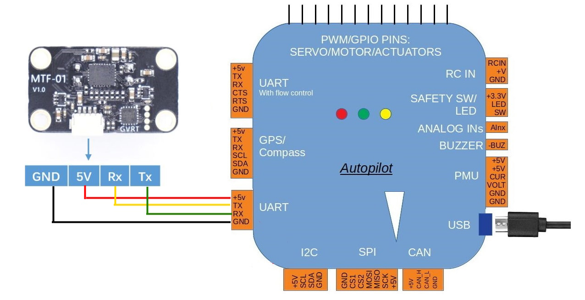

# Drone Hardware

## Parts

### Matek H743-SLIM V2

Connected to the Pi over the PL011 UART on GPIO14/15 — header pins 8 and 10.

| Pi Zero 2 W | H743-SLIM |
|---|---|
| pin 8, GPIO14 (TXD) | `RX2` |
| pin 10, GPIO15 (RXD) | `TX2` |
| pin 6, GND | `GND` |

FC side is the `TX2`/`RX2` through-holes (USART2), which ArduPilot exposes as
`SERIAL3`. On the Pi the port is `/dev/ttyAMA0` at 921600 baud.

Bluetooth must be disabled to get access to these pins. The Bluetooth
controller claims the PL011 UART by default, so `/dev/ttyAMA0` does not exist
until `dtoverlay=disable-bt` is set in `/boot/firmware/config.txt`.

The FC runs 3.3V and GND off the Pi power pins.

### MicoAir MTF-01



Assumes the sensor is on the autopilot's Serial1 port. Any serial port can be
used.

| Parameter | Value | Meaning |
|---|---|---|
| `SERIAL1_BAUD` | `115` | 115200 |
| `SERIAL1_PROTOCOL` | `1` | MAVLink1 |
| `FLOW_TYPE` | `5` | MAVLink |
| `RNGFND1_TYPE` | `10` | MAVLink |

Reboot the autopilot to see the rangefinder parameters, then set:

| Parameter | Value | Meaning |
|---|---|---|
| `RNGFND1_MAX` | `8` | Maximum range 8m |
| `RNGFND1_MIN` | `0.01` | Minimum range |
| `RNGFND1_ORIENT` | `25` | Downward |

Once the sensor is active, the optical flow and range data show up on Mission
Planner's "Status" page — `opt_qua` and `rangefinder1` should have some value.

### LDRobot D500

Connected via USB to the companion computer.

### Arducam IMX708

Connected to the Pi's CSI ribbon connector — Unicam 1, the standard camera port.
Not on a UART, so it does not compete with the FC link or the MTF-01.

| Property | Value |
|---|---|
| Sensor | Sony IMX708, 4608x2592, 10-bit RGGB |
| Detected as | `imx708_wide` |
| Bus | CSI-2 / Unicam 1, i2c-10 addr `0x1a` |
| Autofocus | VCM lens driver, i2c-10 addr `0x0c` |

No `/boot/firmware/config.txt` changes are needed. `camera_auto_detect=1` is set
on the stock image and loads the `imx708` overlay automatically — the vendor
instructions to set `camera_auto_detect=0` with an explicit `dtoverlay=imx708`
only apply when auto-detect fails.

Verify with `rpicam-hello --list-cameras`. `vcgencmd get_camera` reports
`detected=0` even when working — it only knows the removed legacy MMAL stack.

### Video to QGroundControl

The camera is independent of the flight controller — video and MAVLink are two
separate streams that the GCS composites at display time.

```bash
rpicam-vid -t 0 --width 1280 --height 720 --framerate 30 \
  --codec h264 --inline -n \
  --bitrate 2000000 --intra 30 --profile baseline \
  -o udp://<gcs-ip>:5600
```

QGC: Application Settings → Video → source `UDP h.264`, port `5600`.

UDP not TCP — no ACKs or retransmits to consume airtime on the half-duplex
mesh. `--inline` repeats SPS/PPS so a client can join mid-stream, `--intra 30`
gives 1s keyframes for fast recovery, `--profile baseline` avoids B-frame
reordering delay.

**Not persistent — must be started manually after every boot.** A
`nucleus-video.service` gated on `DRONE_ENABLED`, following the
`mavlink-router.service` pattern, is the obvious fix. Not yet built.

Only one process can hold the camera at a time. If a second `rpicam-vid` is
started it may take the port but fail to get the sensor (`Device or resource
busy`, `Failed to queue buffer`), accepting connections while sending no
frames. Fix with `pkill -f rpicam-vid`, then start one instance.

## FC UART Allocation

Through-holes on the H743-SLIM are silkscreened with the STM32 UART number,
which is **not** the ArduPilot `SERIALn` number. Mapping below.

| Through-holes | STM32 UART | ArduPilot |
|------|------|------|
| `TX2` / `RX2` | USART2 | SERIAL3 |
| `TX7` / `RX7` | UART7 | SERIAL1 |
| `TX3` / `RX3` | USART3 | SERIAL4 |
| `TX4` / `RX4` | UART4 | SERIAL6 |

UART7 is the only port with `CTS7`/`RTS7` broken out.
